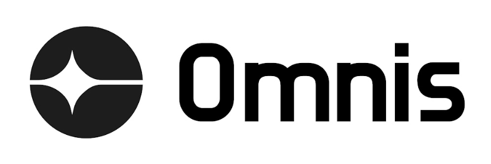

# Omnis Interface

<p align="center">
  <a href="">
    <div style="background-color: white; display: inline-block; padding: 10px; border-radius: 50px;">
        
    </div>
  </a>
</p>

<h4 align="center">Empowers unbanked creators to achieve their financial goals and thrive in their businesses 🏦</h4>
<p align="center">Visit the <a href="" target="_blank">demo site</a></p>
<p align="center">Watch the <a href="" target="_blank">demo video</a></p>
<br />

**Omnis** is a decentralized portfolio manager designed for the Binance Smart Chain (BSC). It enables users to access automated DeFi strategies through simple vault interactions, secured wallet authentication, and smart contract operations — all with a sleek interface and optional AI assistant.

---

## ✨ Features

- ✅ **Wallet Authentication** using Sign-In With Ethereum (SIWE)
- 📊 **Strategy Vaults** with on-chain yield generation
- 🔐 **Aster API Key Integration** for secure, off-chain actions
- 🧠 **AI Portfolio Assistant** (GPT-powered) to guide users through their strategies
- 🟡 **BSC-Only Chain Support**
- ⚡️ **Fast, gas-efficient UI** powered by Next.js and TailwindCSS
- 🔌 Backend support for deposits, withdrawals, and real-time metrics

---

## 🛠️ Tech Stack

| Layer      | Tools Used                                        |
| ---------- | ------------------------------------------------- |
| Frontend   | Next.js, Tailwind CSS, ShadCN UI, Vercel AI SDK   |
| Auth       | WalletConnect, RainbowKit, wagmi, NextAuth + SIWE |
| Backend    | Supabase, Prisma ORM                              |
| Blockchain | Binance Smart Chain, Ethers.js                    |
| API        | Aster API                                         |

---

## 🚀 Getting Started

### 1. Clone the Repository

```bash
git clone https://github.com/your-org/omnis.git
cd omnis
```

## 📝 License

This project is licensed under the **Creative Commons Attribution-NonCommercial-ShareAlike 4.0 International (CC BY-NC-SA 4.0)** license.

You are free to:
- **Share** — copy and redistribute the material in any medium or format
- **Adapt** — remix, transform, and build upon the material

Under the following terms:
- **Attribution** — You must give appropriate credit.
- **NonCommercial** — You may not use the material for commercial purposes.
- **ShareAlike** — If you remix, transform, or build upon the material, you must distribute your contributions under the same license.

🔗 [Read the full license here](https://creativecommons.org/licenses/by-nc-sa/4.0/)